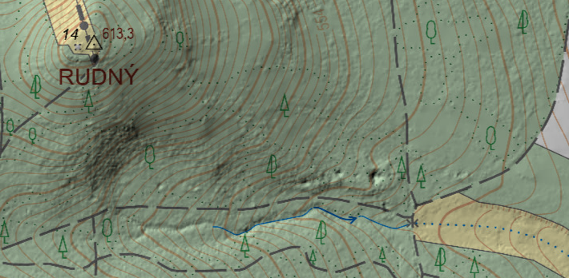
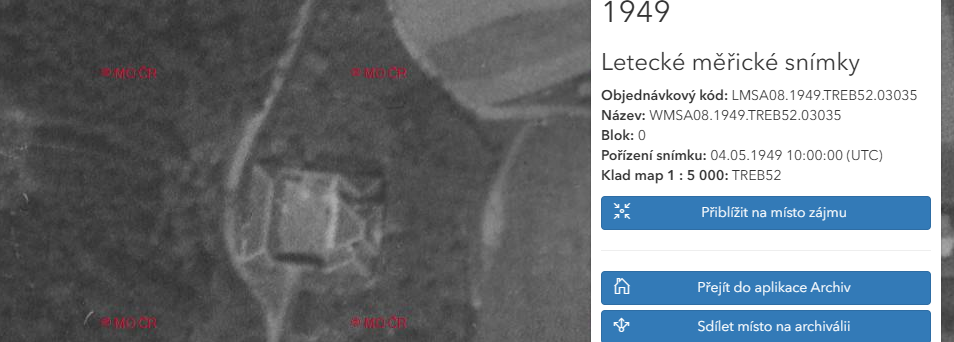
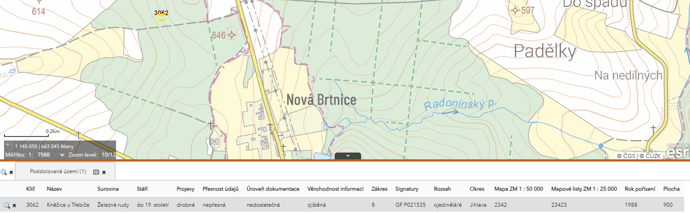
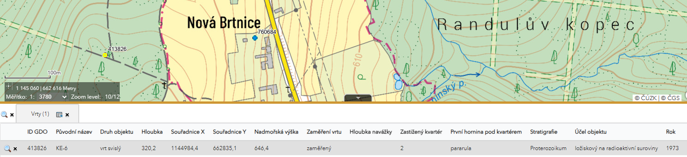
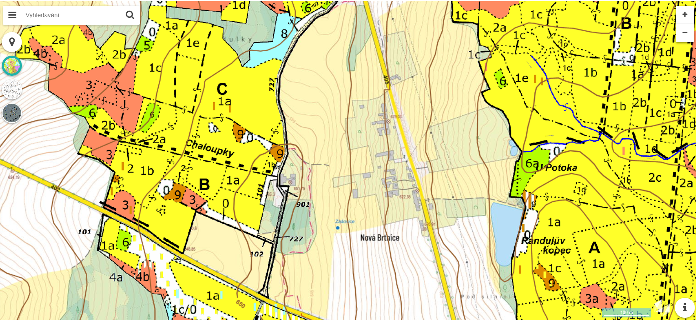
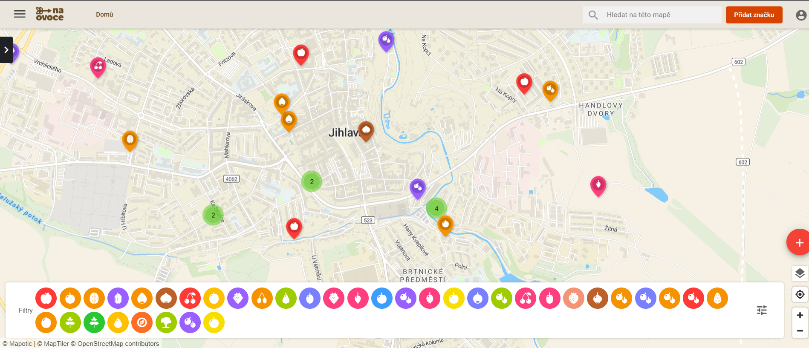
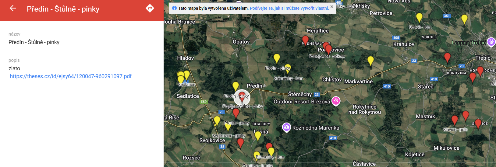
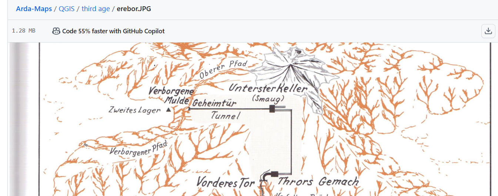
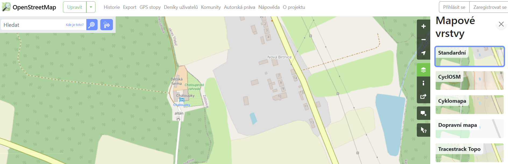

```{r setup, include=FALSE}
knitr::opts_chunk$set(echo = TRUE)
```

# Mapy v 21. století 
RVVZ Chaloupky 2025 \
Autor: Matěj Man \
Aktualizace: 01. 04. 2025 \

Papírovým mapám povětšinou již odzvonilo. V běžném životě ustoupily těm elektronickým.
Papírové tak plní speciální funkce, které mnohdy při práci s dětským 
kolektivem oceníme. 

**Elektronické mapy** 

* navigace v terénu
* plánování, měření, sdílení
* záznam trasy, bodů zájmu

**Papírové mapy**  

* navigace s prvkem dobrodružství
* výuka mapových značek, poledníky + rovnoběžky, souřadnice
* severování mapy, práce s buzolou, azimut, měřítko, vzdálenost
* mapy k pokladu
* mapy jako herní plány 
* orientační běh


## Mapy online

### ČUZK
Český úřad zeměměřický a katastrální

* [Analýzy výškopisu](https://ags.cuzk.cz/geoprohlizec/) \
<a href="dmr5g.PNG" target="_blank">
  
</a>
    * Produkty -> ZABAGED výškopis DMR 5g = digitální model reliéfu 5. generace \
    Dobrý pomocník pro hledání terénních zajímavostí - vidí i do lesa \
    Po kliknutí na ... v seznamu vrstev vpravo prozkoumat: \
    Režim prolnutí - násobit \
    Rastrové funkce - GrayscaleHillshadeZ10 (10x znásobené převýšení) \
    * Produkty -> Archivní ortofoto  (1998 - 2022) 
    \
    
* [Archivní mapy](https://ags.cuzk.gov.cz/archiv/) \
<a href="chaloupky1949.PNG" target="_blank">
  
</a>
    * Archivní mapy - Müllerova mapa Čech a Moravy, Císařské otisky
    * Letecké měřické snímky (1936 - 2024) \
    vlevo nahoře - vyhledat archiválie zadáním místa v mapě \
    Klik do mapy - vlevo se zobrazí jednotlivé snímky \
    Po kliknutí na snímek - přiblížit na místo zájmu \
    Území ČR je pokryté nespojitě \

### ČGS
Česká geologická služba

* [Významné geologické lokality](https://mapy.geology.cz/geologicke_lokality/) \
* [Důlní díla a poddolování](https://mapy.geology.cz/dulni_dila_poddolovani/) \
<a href="dul.PNG" target="_blank">
  
</a>
* [Vrtná prozkoumanost](https://mapy.geology.cz/vrtna_prozkoumanost/) \
<a href="vrt.PNG" target="_blank">
  
</a>

### LČR
Lesy České republiky \

* [Lesní hospodářský plán](https://geoportal.lesycr.cz/itc/?serverconf=default&wmcid=882) \
  Dobrý zdroj informací o lesních cestách, které v jiných mapách nenajdete \
  <a href="lhp.PNG" target="_blank">
  
</a>

### Ostatní drobnosti
* [Mapa výskytu ovocných/jedlých rostlin](https://map.na-ovoce.cz/) \
  <a href="naovoce.PNG" target="_blank">
  
</a>
* [Mapa mineralogických a paleontologických lokalit](https://www.google.com/maps/d/u/0/viewer?mid=19VEgGckc-v8z9p1lSRqzYWokY9k&ll=48.79436439339029%2C19.974958274969293&z=6) \
  <a href="mineral.PNG" target="_blank">
  
</a>
* [Mapy Tolkienovských světů](https://github.com/kwoxer/Arda-Maps/tree/master) \
<a href="tolkien.PNG" target="_blank">
  
</a>

## Open Street Map
OSM \
<a href="osm.PNG" target="_blank">
  
</a>

https://www.openstreetmap.org/  
Mapa vytvářená komunitou - trochu jako Wikipedia akorát mapa. 
Každý může do mapy přispět, upravit, opravit a použít dle svého uvážení \   

##### Příklady použití 

* [Seznam příkladů renderování OSM](https://wiki.openstreetmap.org/wiki/List_of_OSM-based_services)
* [Stamen maps](https://maps.stamen.com/)
* [Schearzplan - business založený na OSM](https://schwarzplan.eu/en/siteplan-and-figure-ground-plan-prague/)
* [Naše místa - business založený na OSM](https://www.nasemista.cz/#gallery)

## QGIS
https://qgis.org/ \
GIS = geografický informační systém (software) \
QGIS = konkrétní software - freeware (zdarma) \

* Software pro prohlížení a tvorbu map, sběr a úpravu mapových dat, přípravu map 
k tisku, mapové analýzy, prostorové a geografické výpočty.
* Nejpoužívanější na světě (společně s komerčním ESRI)
* Modulární - možnost připojit další SW (statistický, skriptovací...)
* Existuje řada zásuvných modulů (pluginů)
* obrovská uživatelská základna (podpora, návody, kurzy, videa)
    * CZ [GIS Mentors](https://gismentors.cz/)
    * CZ [GIS pro Biologické Aplikace](https://labgis.ibot.cas.cz/teaching/)
    * EN [How to install - video](https://youtu.be/lRWHo_3kWEY?si=LlsseRh_Mq-ZPtIv)
    * EN [QGIS Tutorials](https://www.qgistutorials.com/en/index.html)

### Zdroje dat pro GIS
* Stahování OSM [Geofabrik](https://download.geofabrik.de/)
* Stahování OSM přímo v QGIS plugin [quickOSM](https://plugins.qgis.org/plugins/QuickOSM/)
* Globální data [Natural Earth](https://www.naturalearthdata.com/)
* CZ základní mapa 1:50 000 [Data 50](https://ags.cuzk.gov.cz/geoprohlizec/?atom=data50)
* [kartografická vizualizace ČUZK QGIS](https://geoportal.cuzk.gov.cz/Dokumenty/data200_qgis.zip) 
  * kopírování symbologie přetáhování prvků (drag & drop) z jednoho okna QGOS do druhého
  * WMS vrstvy - podkladové mapy
  * symbology - rendering - multiply
  
## Mapové aplikace chytrý telefon

#### mapy.cz
- Moje mapy - Import/Export - GPX formát
- Přetáhnout (drag & drop) GPX formát do prohlížeče s mapy.cz

#### OsmAnd
- placená (ca 250 Kč/rok)
- kombinace OSM + Wikipedia
- oflline mapy, skvělá pro cestování
- skvělé vyhledávání POI (body zájmu)

#### Custom Maps
- pouze Android
- referencování fotky podle google maps
- vyfotím plánek zoo, srovnám fotku podle google mapy a vidím na plánku svou polohu

### Nestforms
- sběr georeferencovaných dat 
- lokalizované fotky, výskyty, dotazníky


